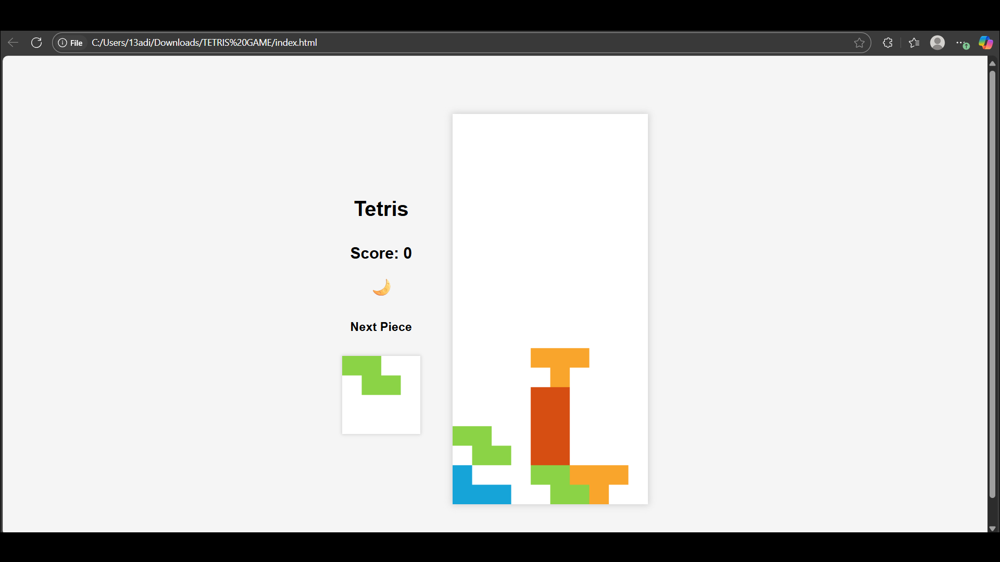
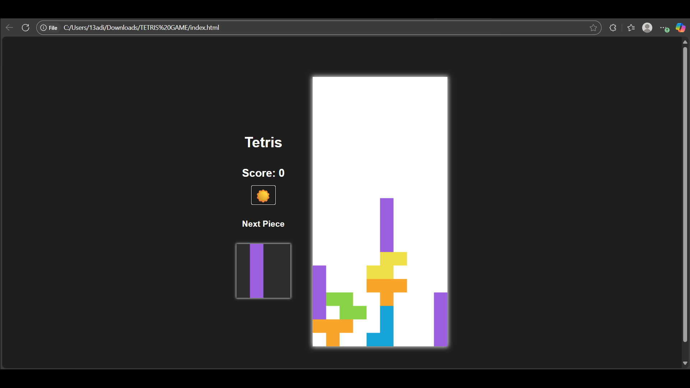
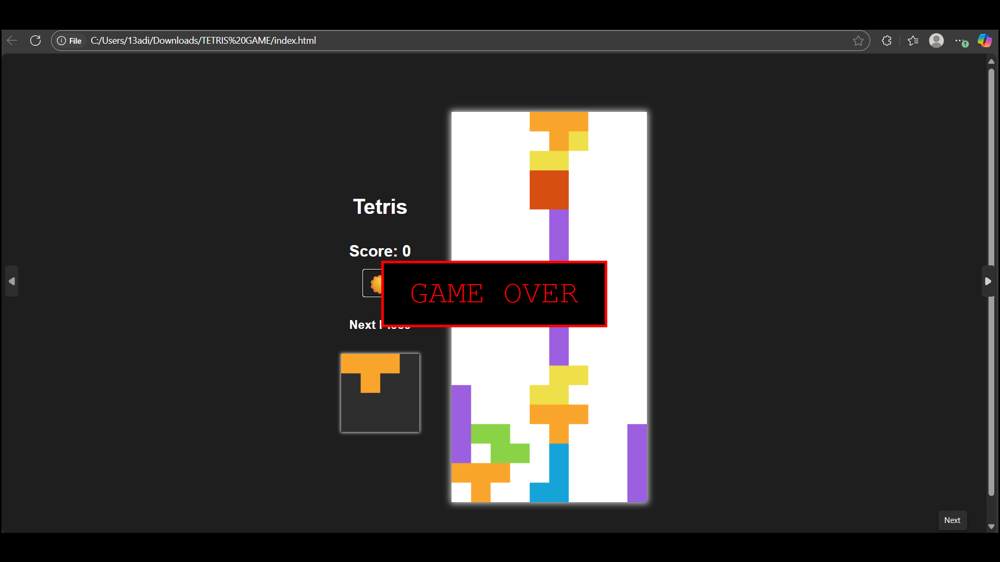

# TetrisGame
🎮🟦

A classic Tetris game built with **HTML**, **CSS**, and **JavaScript**, enhanced with modern features to improve your gaming experience!

## Features

- Classic Tetris gameplay with smooth block rotation.
- Score display to keep track of your progress.
- Theme toggle — switch between **dark mode** and **normal (light) mode**.
- Preview of the next Tetris piece.
- Responsive controls and interface.

## How to Play

- Use arrow keys to move and rotate the blocks.
- Complete lines to score points and clear the board.
- Avoid filling the board to the top.
- Use the theme toggle to switch between dark and light modes.
- Watch the piece preview to plan your next moves.

## Technologies Used

- **HTML5** — structure and layout
- **CSS3** — styling and themes
- **JavaScript** — game mechanics, controls, scoring, and UI

## How to Run Locally

1. Clone this repository:

   ```bash
   git clone https://github.com/yourusername/tetris-game.git

2. Open `index.html` in your favorite web browser.

3. Start playing!

## Screenshots







## Future Improvements

- Add high score tracking with local storage.
- Implement mobile touch controls.
- Add more sound effects and music options.
- Include difficulty levels.

